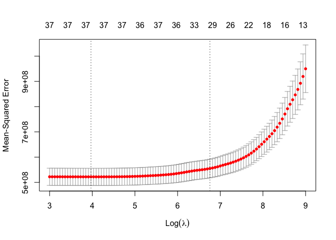
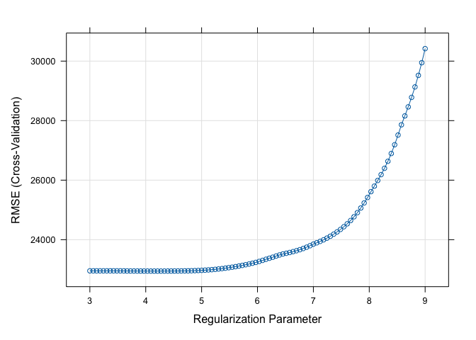

ds2_homework1
================
Minghe Wang
2025-03-14

We predict the sale price of a house based on various characteristics.
The training data are in `housing train.csv`, and the test data are in
`housing test.csv`. The response is in the column “Sale price”, and
other variables can be used as predictors. The variable definitions can
be found in `dictionary.txt`.

``` r
house_train <- read_csv("./data/housing_training.csv")
```

    ## Rows: 1440 Columns: 26
    ## ── Column specification ────────────────────────────────────────────────────────
    ## Delimiter: ","
    ## chr  (4): Overall_Qual, Kitchen_Qual, Fireplace_Qu, Exter_Qual
    ## dbl (22): Gr_Liv_Area, First_Flr_SF, Second_Flr_SF, Total_Bsmt_SF, Low_Qual_...
    ## 
    ## ℹ Use `spec()` to retrieve the full column specification for this data.
    ## ℹ Specify the column types or set `show_col_types = FALSE` to quiet this message.

``` r
house_test <- read_csv("./data/housing_test.csv")
```

    ## Rows: 959 Columns: 26
    ## ── Column specification ────────────────────────────────────────────────────────
    ## Delimiter: ","
    ## chr  (4): Overall_Qual, Kitchen_Qual, Fireplace_Qu, Exter_Qual
    ## dbl (22): Gr_Liv_Area, First_Flr_SF, Second_Flr_SF, Total_Bsmt_SF, Low_Qual_...
    ## 
    ## ℹ Use `spec()` to retrieve the full column specification for this data.
    ## ℹ Specify the column types or set `show_col_types = FALSE` to quiet this message.

``` r
house_train <- na.omit(house_train) %>% 
  mutate(across(where(is.character), as.factor))

house_test <- na.omit(house_test) %>% 
  mutate(across(where(is.character), as.factor))
# str(house_train)
# str(house_test)
```

## (a)

``` r
# cross validation setup
x <- model.matrix(Sale_Price ~ . -1, house_train)
y <- house_train$Sale_Price

set.seed(2025)
# cv.lasso <- cv.glmnet(x, y, 
#                       alpha = 1)
# print(max(cv.lasso$lambda)) # 54596.94
# print(min(cv.lasso$lambda)) # 38.51706

cv.lasso <- cv.glmnet(x, y, 
                      alpha = 1,
                      lambda = exp(seq(9, 3, length = 100)))

predict(cv.lasso, s = cv.lasso$lambda.min, type = "coefficients")
```

    ## 41 x 1 sparse Matrix of class "dgCMatrix"
    ##                                       s1
    ## (Intercept)                -4.855623e+06
    ## Gr_Liv_Area                 6.555839e+01
    ## First_Flr_SF                7.966301e-01
    ## Second_Flr_SF               .           
    ## Total_Bsmt_SF               3.538105e+01
    ## Low_Qual_Fin_SF            -4.112467e+01
    ## Wood_Deck_SF                1.170219e+01
    ## Open_Porch_SF               1.557176e+01
    ## Bsmt_Unf_SF                -2.089010e+01
    ## Mas_Vnr_Area                1.080864e+01
    ## Garage_Cars                 4.113346e+03
    ## Garage_Area                 8.078203e+00
    ## Year_Built                  3.237171e+02
    ## TotRms_AbvGrd              -3.656728e+03
    ## Full_Bath                  -3.932055e+03
    ## Overall_QualAbove_Average   .           
    ## Overall_QualAverage        -4.885004e+03
    ## Overall_QualBelow_Average  -1.252142e+04
    ## Overall_QualExcellent       7.498681e+04
    ## Overall_QualFair           -1.082769e+04
    ## Overall_QualGood            1.214899e+04
    ## Overall_QualVery_Excellent  1.347759e+05
    ## Overall_QualVery_Good       3.790737e+04
    ## Kitchen_QualFair           -2.521129e+04
    ## Kitchen_QualGood           -1.753427e+04
    ## Kitchen_QualTypical        -2.562010e+04
    ## Fireplaces                  1.069254e+04
    ## Fireplace_QuFair           -7.699186e+03
    ## Fireplace_QuGood            .           
    ## Fireplace_QuNo_Fireplace    1.681203e+03
    ## Fireplace_QuPoor           -5.673994e+03
    ## Fireplace_QuTypical        -7.011896e+03
    ## Exter_QualFair             -3.416912e+04
    ## Exter_QualGood             -1.586478e+04
    ## Exter_QualTypical          -2.029687e+04
    ## Lot_Frontage                1.001554e+02
    ## Lot_Area                    6.044026e-01
    ## Longitude                  -3.326185e+04
    ## Latitude                    5.577739e+04
    ## Misc_Val                    8.455682e-01
    ## Year_Sold                  -5.760325e+02

``` r
X_test <- model.matrix(Sale_Price ~ . - 1, data = house_test)
y_test <- house_test$Sale_Price

# Get predictions using the best lambda
predictions_min <- predict(cv.lasso, newx = X_test, s = cv.lasso$lambda.min)

# Calculate Mean Squared Error (MSE)
test_rmse_min <- sqrt(mean((predictions_min - y_test)^2))
```

Note: We predefined a range for tuning parameter based on the maximum
and minimum lambda of the model with default(data-driven) tuning
parameter.

The selected tuning parameter $\lambda$ is 52.9684774, and the test
error(RMSE) is 2.1005705^{4}.

``` r
# get prediction w/ lambda + 1se
predictions_1se <- predict(cv.lasso, newx = X_test, s = cv.lasso$lambda.1se)

# get number of predictors
coef_1se_lasso <- predict(cv.lasso, s = cv.lasso$lambda.1se, type = "coefficients")
num_predictors_1se_lasso <- sum(coef_1se_lasso[-1] != 0) 

# Calculate Mean Squared Error (MSE)
test_rmse_1se <- sqrt(mean((predictions_1se - y_test)^2))
```

When applied 1SE rule(i.e. minimum lambda + 1 standard error), the model
has number of predictors = 29 ; test error(RMSE) = 2.052481^{4}, which
is acceptable.

## (b)

``` r
ctrl1 <- trainControl(method = "cv", number = 10, selectionFunction = "best")
ctrl2 <- trainControl(method = "cv", number = 10, selectionFunction = "oneSE")

set.seed(2025)

enet.fit_caret_bestPar <- train(Sale_Price ~ ., data = house_train,
                           method = "glmnet",
                           tuneGrid = expand.grid(alpha = seq(0, 1, length = 21),
                                                  lambda = exp(seq(9, 3, length = 100))),
                           trControl = ctrl1)


enet.fit_caret_1sePar <- train(Sale_Price ~ ., data = house_train,
                           method = "glmnet",
                           tuneGrid = expand.grid(alpha = seq(0, 1, length = 21),
                                                  lambda = exp(seq(9, 3, length = 100))),
                           trControl = ctrl2)

# cat("best lambda by caret:", enet.fit_glm$lambda.min) # 469.4281
# cat("1se lambda by caret:", enet.fit_caret$bestTune$lambda) # 529.9206

enet_pred_best <- predict(enet.fit_caret_bestPar, newdata = house_test, 
                          s = enet.fit_caret_bestPar$bestTune)
enet_pred_1se <- predict(enet.fit_caret_1sePar, newdata = house_test, 
                         s = enet.fit_caret_1sePar$bestTune)

test_rmse_enet_min <- sqrt(mean((y_test - enet_pred_best)^2))
test_rmse_enet_1se <- sqrt(mean((y_test - enet_pred_1se)^2))
```

The selected tuning parameter are $\lambda$ = 635.5847584, $\alpha$ =
0.05, and its RMSE is 2.0929442^{4}.

1SE Rule can be applied to $\lambda$ only, not to $\alpha$. We need to
use `caret` elastic net model to find the best tune $\alpha$ and then
use `glmnet` to apply the 1SE Rule while keeping $\alpha$ fixed.

When 1SE Rule applied, the tuning parameters are $\alpha$ = 0, $\lambda$
= 8103.0839276, and test RMSE is 2.0687914^{4}. This result suggests
that cross validation process might find the most optimal model is ridge
regression for given dataset, which deserves further investigation on
the reason behind it.

## (c)

``` r
set.seed(2025)
pls.fit_caret <- train(Sale_Price ~ ., data = house_train,
                   method = "pls",
                   tuneGrid = data.frame(ncomp = 1:29), 
                   trControl = ctrl1,
                   preProcess = c("center", "scale"))


best_ncomp_caret_pls <- pls.fit_caret$bestTune$ncomp 

pred_pls <- predict(pls.fit_caret, newdata = house_test)
test_rmse_pls <- sqrt(mean((y_test - pred_pls)^2))
```

The test RMSE using PLS model is 2.124327^{4}, and there are 11
components selected by the best PLS model.

## (d)

``` r
error_table <- data.frame(
  Model = c("LASSO", "Elastic Net", "PLS"),
  Test_RMSE = c(test_rmse_min, test_rmse_enet_min, test_rmse_pls)
) 

print(error_table)
```

    ##         Model Test_RMSE
    ## 1       LASSO  21005.70
    ## 2 Elastic Net  20929.44
    ## 3         PLS  21243.27

## (e)

``` r
set.seed(2025)
lasso.fit_caret <- train(Sale_Price ~ ., data = house_train,
                         method = "glmnet",
                         tuneGrid = expand.grid(alpha = 1,
                                                lambda = exp(seq(9, 3, length = 100))),
                         trControl = ctrl1)


lambda_glm <- cv.lasso$lambda.min
lambda_caret <- lasso.fit_caret$bestTune$lambda
plot(cv.lasso)
```

<!-- -->

``` r
plot(lasso.fit_caret, xTrans = log)
```

<!-- -->

By `glmnet`, the tuning parameter $\lambda$ = 52.9684774; by `caret`,
$\lambda$ = 67.499569. Even though we specify using `glmnet` method in
`caret` model fitting, there is still difference in selection of “best”
$\lambda$. However, we consider this as an acceptable difference
especially when considering within the exponential
grid($log(\lambda_{glm})$ = 3.969697; $log(\lambda_{caret})$ =
4.2121212). The source of such difference might be from how each
function sets up cross-validation or potentially different default error
metrics or tie-breaking decisions.

``` r
set.seed(2025)
resamp <- resamples(list(
  Lasso = lasso.fit_caret,
  ElasticNet = enet.fit_caret_bestPar,
  PartialLeastSq = pls.fit_caret
))

summary(resamp)
```

    ## 
    ## Call:
    ## summary.resamples(object = resamp)
    ## 
    ## Models: Lasso, ElasticNet, PartialLeastSq 
    ## Number of resamples: 10 
    ## 
    ## MAE 
    ##                    Min.  1st Qu.   Median     Mean  3rd Qu.     Max. NA's
    ## Lasso          14741.81 15558.94 16287.66 16679.12 17493.05 19165.85    0
    ## ElasticNet     14793.66 15493.40 16258.31 16648.24 17495.94 19152.10    0
    ## PartialLeastSq 14848.76 15656.74 16411.28 16743.46 17517.21 19194.05    0
    ## 
    ## RMSE 
    ##                    Min.  1st Qu.   Median     Mean  3rd Qu.     Max. NA's
    ## Lasso          19791.29 21882.13 22646.63 22944.34 23780.51 27025.10    0
    ## ElasticNet     19835.20 21896.69 22623.14 22939.56 23780.08 27076.72    0
    ## PartialLeastSq 19837.01 21953.53 22716.43 22945.08 23772.46 26935.47    0
    ## 
    ## Rsquared 
    ##                     Min.   1st Qu.    Median      Mean   3rd Qu.      Max. NA's
    ## Lasso          0.8774196 0.8893621 0.9002852 0.9021467 0.9163729 0.9249267    0
    ## ElasticNet     0.8778045 0.8894517 0.9004570 0.9021908 0.9159685 0.9255766    0
    ## PartialLeastSq 0.8774820 0.8893300 0.8997448 0.9020588 0.9164506 0.9243377    0

In last question, we found the Elastic Net slightly outperform the other
two model by measuring RMSE. Since we just fit the lasso model w/
`caret`, we can directly compare how well three model predicts on test
data. And the result aligns w/ our belief that Elastic Net still perform
better than other two models overall.

``` r
set.seed(2025)
train_id_list <- lasso.fit_caret$control$index

dat_dummy <- data.frame(Sale_Price = y, x)
M <- 10
lambda.grid <- exp(seq(9, 3, length = 100))
rmse <- rmse_caret <- matrix(NA, ncol = 100, nrow = M)

for (m in 1:M)
{
  tsdata <- dat_dummy[train_id_list[[m]],] 
  vsdata <- dat_dummy[-train_id_list[[m]],] 
  
  x1 <- as.matrix(tsdata[,-1])
  y1 <- tsdata[,1]
  x2 <- as.matrix(vsdata[,-1])
  y2 <- vsdata[,1]
  
  fit <- glmnet(x1, y1, alpha = 1, 
                lambda = lambda.grid)
  
  # caret implementation did not specify lambda
  # the default grid of lambda is different from lambda.grid
  fit_caret <- glmnet(x1, y1, alpha = 1)
  
  pred <- predict(fit, newx = x2, s = lambda.grid)
  pred_caret <- predict(fit_caret, newx = x2, s = lambda.grid)
  
  rmse[m,] <- sqrt(colMeans((y2 - pred)^2))
  rmse_caret[m,] <- sqrt(colMeans((y2 - pred_caret)^2))
}

# curve from glmnet (correct)
plot(log(lambda.grid), colMeans(rmse), col = 3, xlab = "log(lambda)", ylab = "CV RMSE")
abline(v = log(lambda.grid[which.min(colMeans(rmse))]))

# caret results
points(log(lasso.fit_caret$results$lambda), lasso.fit_caret$results$RMSE, col = 2)

# try to reproduce caret results from scratch
points(log(lambda.grid), colMeans(rmse_caret), col = rgb(0,0,1,alpha = 0.3))
```

<!-- -->

``` r
# selected lambda
lambda.grid[which.min(colMeans(rmse))]
```

    ## [1] 71.71696

``` r
# the corresponding CV RMSE
min(colMeans(rmse))
```

    ## [1] 22945.54

As being awared of an small implementation error of caret model, we
adjust the algorithm of caret. And the selection of lambda is still in
an acceptable range comparing to glmnet.
